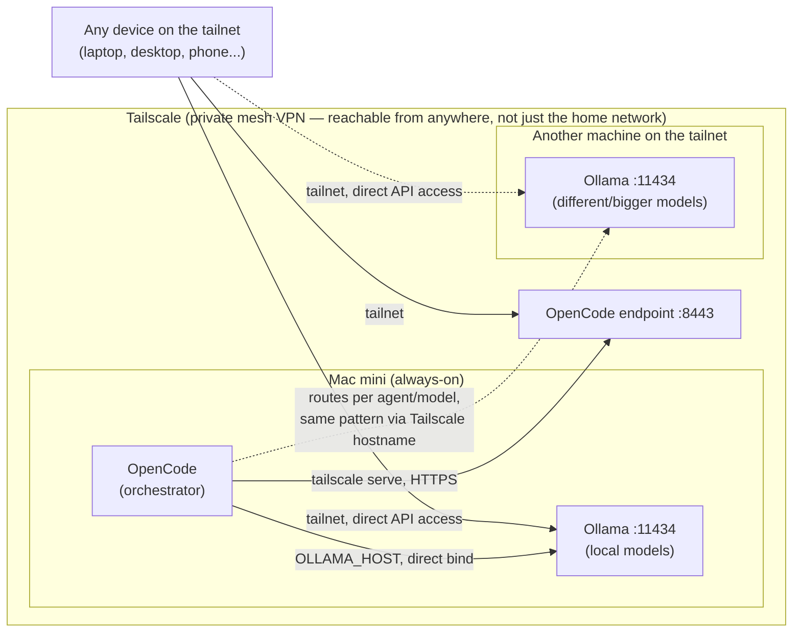

# My Mac mini as a personal AI infrastructure

A Mac mini, turned into an always-on local AI stack: local models (Ollama), a shared coding agent across machines (OpenCode), a private mesh network to reach it all safely (Tailscale) — and growing. This repo documents each layer as I build it, with the reasoning and sources behind every choice, not just the commands.

*Author: Alessandro Iori ([@alessandroiori](https://github.com/alessandroiori)) · Created: September 2026 · Last updated: September 2026*

## Architecture

The Mac mini is the always-on hub: OpenCode runs there as the orchestrator, calling out to its own local Ollama *and* to Ollama on another machine on the tailnet — a laptop, a workstation, whatever has the right model for a given agent/task. But Ollama isn't hidden behind OpenCode: since it's bound directly to its own Tailscale IP (not proxied), any device on the tailnet can also call its API directly, bypassing OpenCode entirely — useful for quick `curl` tests or other tools that want raw model access. OpenCode's HTTPS endpoint is the separate, single entry point for the coding-agent workflow itself. The tailnet is a flat mesh, so this holds the same way for a laptop, another PC, or a phone away from home — there's no structural distinction between them, only between something that's a pure client and something (like the "other machine" above) that also hosts a service.

## Guides

1. **[Ollama + OpenCode + Tailscale — the always-on local AI server](docs/01-ollama-opencode-tailscale.md)** — the base layer: local model serving, multi-machine config sync, `launchd` persistence, Tailscale exposure, network security checklist, maintenance.
2. **MLX as a native alternative to Ollama** — *exploring, not started.* Evaluating Apple's own ML framework (built for unified memory) in place of Ollama, for potential RAM/throughput gains on Apple Silicon.
3. **[LightRAG + a custom MCP server — long-term memory](docs/03-lightrag-mcp-memory.md)** — a personal knowledge base (documents, notes) on top of the same Mac mini, queried via MCP, exposed the same way over Tailscale.

## Requirements (common to all guides here)

- An Apple Silicon Mac. Unified memory is the real constraint — more of it means bigger/more models comfortably.
- Ethernet, not Wi-Fi, on the always-on machine (see guide 1 for why).
- A Tailscale account (free tier covers personal use).
- A GitHub account if you sync config across more than one machine.

---

*If this is useful, a star is appreciated. Issues and PRs — corrections, alternative stacks, gotchas you hit that aren't covered here — are welcome.*
