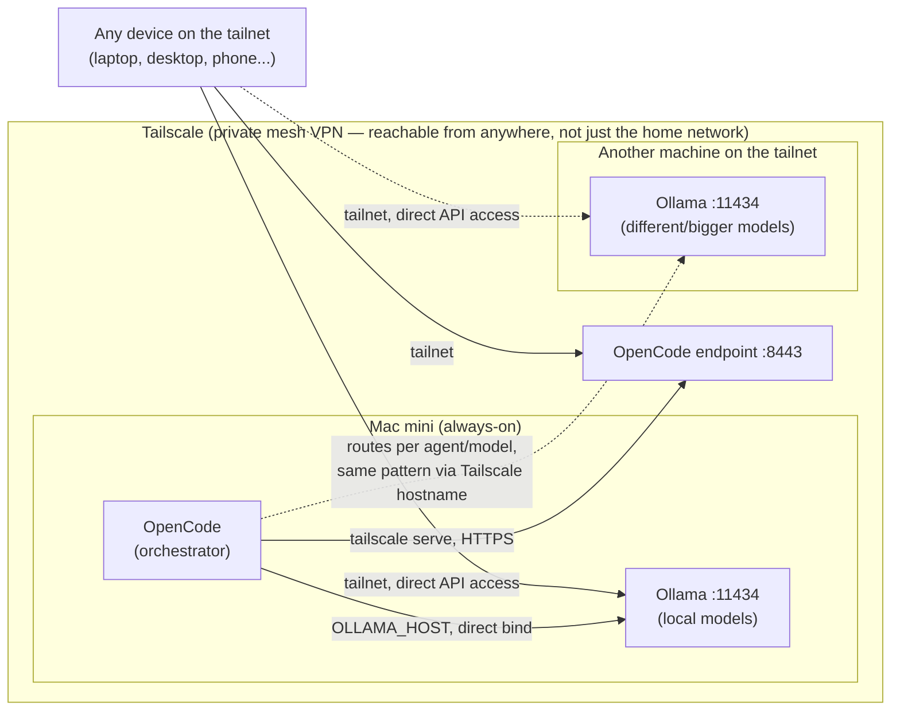

[← back to project overview](../README.md)

# Part 1: Ollama + OpenCode + Tailscale — the always-on local AI server

A practical guide to running local LLMs on Apple Silicon as a real, always-on service — reachable from your other machines over a private network, surviving reboots, logouts, and power outages. Not just a command list: every architectural choice is explained, and every problem hit along the way is documented as a general lesson, with sources.

**Stack:** [Ollama](https://ollama.com) (local model runtime) + [OpenCode](https://opencode.ai) (AI coding agent, synced across machines) + [Tailscale](https://tailscale.com) (private mesh VPN), running as macOS `launchd` system daemons on a Mac mini.

*Author: Alessandro Iori ([@alessandroiori](https://github.com/alessandroiori)) · Created: September 2026 · Last updated: September 2026*

## TL;DR

- Run Ollama + OpenCode as **LaunchDaemons** (not LaunchAgents) so they survive logout and reboot without a graphical session.
- Don't put Ollama behind `tailscale serve` — it 403s reverse-proxied requests by design. Bind it directly to its Tailscale IP instead.
- Ethernet isn't optional for a headless boot on this architecture — Wi-Fi may not reconnect before the login screen.
- FileVault-on vs FileVault-off is a real trade-off for a headless server, not a default to accept blindly — see the table below.
- If you sync OpenCode config across machines, never hardcode `localhost` in anything synced; use Tailscale hostnames instead.

## Architecture



The Mac mini is the always-on hub: OpenCode runs there as the orchestrator, calling out to its own local Ollama *and* to Ollama on another machine on the tailnet — a laptop, a workstation, whatever has the right model for a given agent/task. But Ollama isn't hidden behind OpenCode: since it's bound directly to its own Tailscale IP (not proxied), any device on the tailnet can also call its API directly, bypassing OpenCode entirely — useful for quick `curl` tests or other tools that want raw model access. OpenCode's HTTPS endpoint is the separate, single entry point for the coding-agent workflow itself. The tailnet is a flat mesh, so this holds the same way for a laptop, another PC, or a phone away from home — there's no structural distinction between them, only between something that's a pure client and something (like the "other machine" above) that also hosts a service.

## Table of contents

- [Architecture](#architecture)
- [Requirements](#requirements)
- [Part 1.1 — System checklist before installing anything](#part-11--system-checklist-before-installing-anything)
- [Part 1.2 — Installing the stack](#part-12--installing-the-stack)
- [Part 1.3 — Multi-machine OpenCode configuration](#part-13--multi-machine-opencode-configuration)
- [Part 1.4 — Always-on services (LaunchDaemons)](#part-14--always-on-services-launchdaemons)
- [Part 1.5 — Exposing services over Tailscale](#part-15--exposing-services-over-tailscale)
- [Part 1.6 — Network security checklist](#part-16--network-security-checklist)
- [Part 1.7 — Operational maintenance](#part-17--operational-maintenance)
- [Model sizing on unified memory](#model-sizing-on-unified-memory)
- [Uninstalling everything](#uninstalling-everything)
- [Sources](#sources)

## Requirements

- An Apple Silicon Mac. Unified memory is the real constraint — more of it means bigger/more models comfortably. An M4 with 32GB handles models up to roughly 27-30B parameters while leaving headroom for the system and context.
- **Ethernet, not Wi-Fi** — see the dedicated gotcha below; on this architecture it's not "nice to have," it's what makes a reliable headless boot possible.
- A router where you can reserve a fixed IP via DHCP for the Mac mini's MAC address.
- A Tailscale account (free tier covers personal use).
- If you work from more than one machine: a GitHub account for a private config-sync repo.

---

## Part 1.1 — System checklist before installing anything

Do this right after the initial macOS setup.

- **Enable Remote Login (SSH)**: *System Settings → General → Sharing → Remote Login*. Do this before deciding anything about FileVault.
- **Update macOS to the latest version**: *System Settings → General → Software Update*. Recent macOS Tahoe (26.5+) releases improve the reliability of SSH-based FileVault unlock over Wi-Fi (see below) and add a "Start up when power is connected" power option.
- **Wired network, static IP**: connect via Ethernet and reserve its local IP from your router (DHCP reservation on the MAC address).

  > **Empirically confirmed gotcha:** on a Mac connected over **Wi-Fi**, after a reboot the network may not come back up even at the login screen — making SSH, Tailscale, and any service unreachable until someone logs in physically. Over **Ethernet**, this disappears. For an always-on headless server, Ethernet isn't an optimization — it's what makes the whole headless architecture work at all.

- **Decide what to do about FileVault.** This is the most important trade-off in the whole guide, worth deciding deliberately rather than defaulting into it:

  | Option | Pro | Con |
  |---|---|---|
  | **FileVault on + SSH unlock** | Disk protected by a password on top of baseline hardware encryption | Every unplanned reboot (power outage included) locks the Mac in pre-boot until someone manually SSHes in to unlock it — **this is the norm on every reboot, not a rare event to handle once** |
  | **FileVault off + automatic login** | The Mac comes back fully operational on its own after any reboot, always | The disk relies only on Apple Silicon's always-on hardware encryption, without the extra human-password requirement |

  Multiple sources — including an Apple DTS engineer weighing in on a headless-server thread — recommend the second option for a headless server in a physically secure location (a home, not a shared office): *"Just turn FileVault off. Turn Automatic Login on, and be done with it."* ([Apple Community](https://discussions.apple.com/thread/253682124), [Macworld](https://www.macworld.com/article/2568036/how-to-manage-filevault-to-maintain-remote-access-to-your-mac.html)). If you'd rather keep the extra password and accept manual intervention on unplanned reboots, macOS Tahoe ships an SSH-based FileVault pre-boot unlock that makes that intervention quick.

  **If you keep FileVault on — how SSH unlock works (macOS Tahoe, tested on an Apple Silicon Mac mini):**
  1. Requirements: Apple Silicon, macOS Tahoe (26.x), FileVault on, Remote Login enabled.
  2. After a reboot, the Mac sits locked at the pre-boot screen — **the actual OS hasn't booted yet at this stage**, so Tailscale, your daemons, or any normal network service aren't reachable.
  3. From another device **on the same local network** (this uses mDNS/local IP, not Tailscale — it doesn't work from outside the LAN):
     ```bash
     ssh <user>@<mac-local-ip>
     ```
  4. Expected response: *"This system is locked. To unlock it, use a local account name and password..."* — enter your account password, then *"System successfully unlocked... Connection closed"*. The connection closes itself while boot continues.
  5. A second SSH connection a few seconds later works as a normal session, post-boot.

  Sources: [Der Flounder – Unlocking FileVault via SSH on macOS Tahoe](https://derflounder.wordpress.com/2025/10/11/unlocking-filevault-via-ssh-on-macos-tahoe/), [Jeff Geerling – You can finally manage Macs with FileVault remotely in Tahoe](https://www.jeffgeerling.com/blog/2025/you-can-finally-manage-macs-filevault-remotely-tahoe/), [Apple Support – Volume encryption with FileVault](https://support.apple.com/guide/security/volume-encryption-with-filevault-sec4c6dc1b6e/web) (confirms Apple Silicon always hardware-encrypts via the Secure Enclave, even with FileVault off).

  **Limitation:** this unlock only works from your home network. If you're away when an unplanned reboot happens, the Mac stays locked until someone at home (or another always-on device there) unlocks it. One way around this: a small always-on device at home (a Raspberry Pi or a cheap mini PC — not a bare Arduino, it lacks a full network/OS stack) set up as a **Tailscale subnet router** (`tailscale up --advertise-routes=<home-subnet>`), bridging your home LAN into the tailnet so the unlock works from anywhere. Not built out in this guide, but the natural next step.

- **Energy settings** (*System Settings → Energy*):
  - "Start up automatically after a power failure" → on.
  - "Prevent automatic sleeping when the display is off" → on.
  - "Wake for network access" → on.
  - On macOS 26.5+: the new "Start up when power is connected" → **Always** (Mac mini 2024+). Unlike the first option (which covers a reboot while the Mac was already on), this powers the Mac back on even from a fully-off state — more robust for extended outages. Keep both enabled.
    ```bash
    sudo pmset autorestartatconnect 1
    pmset -g | grep autorestartatconnect   # verify
    ```
    Sources: [Apple Support – Turn on a Mac without pressing its power button](https://support.apple.com/en-am/125517), [Der Flounder – pmset autorestartatconnect](https://derflounder.wordpress.com/2026/05/12/using-pmset-to-set-your-mac-to-automatically-power-on-when-power-is-available-on-macos-tahoe-26-5-0/).

---

## Part 1.2 — Installing the stack

### Homebrew

```bash
/bin/bash -c "$(curl -fsSL https://raw.githubusercontent.com/Homebrew/install/HEAD/install.sh)"
```
There's no official downloadable `.pkg` installer — only this terminal script ([docs.brew.sh/Installation](https://docs.brew.sh/Installation), [GitHub Homebrew/discussions#5509](https://github.com/orgs/Homebrew/discussions/5509)). The "Downloading Command Line Tools for Xcode" step can look stuck for 10-30 minutes with zero terminal feedback — that's normal; real progress shows in *System Settings → Software Update* ([GitHub Homebrew/discussions#3053](https://github.com/orgs/Homebrew/discussions/3053)).

### Ollama

```bash
brew install ollama
```
Prefer the Homebrew formula over the Electron app: no background updater, one binary managed consistently with the rest of the stack.

```bash
ollama pull <model>:<tag>
ollama list      # downloaded models
ollama ps        # models currently loaded in memory
```

Pull model updates periodically (weekly `ollama pull` on each) — bug fixes ship even without a tag change.

> **Worth exploring separately:** [MLX](https://github.com/ml-explore/mlx), Apple's own ML framework built for unified memory, is a potential alternative to Ollama for better RAM/throughput on Apple Silicon — not evaluated in this guide yet.

### GitHub CLI and OpenCode

```bash
brew install gh
gh auth login   # GitHub.com → HTTPS → browser login

brew install opencode   # available directly from homebrew-core, no external tap needed
```

---

## Part 1.3 — Multi-machine OpenCode configuration

If you use OpenCode from more than one machine (an always-on server plus one or more laptops), two problems need solving: how to share config (agents, providers, prompts) across machines, and how to keep machine-specific settings from breaking the others.

**One provider block per machine**, in `~/.config/opencode/opencode.json`:
```json
{
  "provider": {
    "ollama-<machine-name>": {
      "npm": "@ai-sdk/openai-compatible",
      "name": "Ollama (<machine-name>)",
      "options": { "baseURL": "http://<machine-tailscale-hostname>:11434/v1" },
      "models": { "<model-tag>": { "name": "<model-tag>" } }
    }
  }
}
```

**Golden rule: use Tailscale hostnames (`*.ts.net`) in `baseURL`, never `localhost`/`127.0.0.1`.** A `localhost` baseURL is only valid on the machine that hosts it — if the config is shared across machines (see below), it would point to the wrong thing everywhere else. A Tailscale hostname is reachable identically from any node on the tailnet: agents/providers pointing at different machines aren't really hardcoding a machine, they're doing **capability-based routing** (which node has the right model for this task — see the Architecture diagram above, which shows the Mac mini's OpenCode routing to a second machine's Ollama this way).

**Syncing config across machines** with the [opencode-synced](https://github.com/iHildy/opencode-synced) plugin (a private GitHub repo):
```bash
gh repo create my-opencode-config --private
```
Add `"opencode-synced"` to the `plugin` array in `opencode.json`, then inside OpenCode: `/sync-init` on the first machine (creates and pushes the repo), `/sync-link` on the others (pulls and **overwrites** local config — destructive on the machine that runs it). After that: `/sync-pull` and `/sync-push` for updates.

**Local per-machine overrides.** Anything synced gets overwritten on every pull, so anything valid only on one machine needs to stay out of the shared file. The plugin supports `~/.config/opencode/opencode-synced.overrides.jsonc`: a local, un-synced file that's "merged and reapplied" on top of the config after every `/sync-pull`. Use it for: that machine's preferred default model, hardware-tuned temperature/context, or a provider that genuinely does point at `localhost` (fine there, since it's never meant to be shared).

Before publishing the sync repo, audit it for anything machine-specific:
```bash
gh repo clone <sync-repo-name> /tmp/audit-sync-repo
cd /tmp/audit-sync-repo
grep -riE "localhost|127\.0\.0\.1|<your-username>" .
```

---

## Part 1.4 — Always-on services (LaunchDaemons)

Ollama and OpenCode need to start at boot and survive logout/reboot independent of any graphical session — which means they belong as **system LaunchDaemons** (in `/Library/LaunchDaemons/`), not user LaunchAgents.

> **Critical gotcha, applies to any LaunchDaemon with a non-root `UserName`:** on macOS, a LaunchDaemon running as a non-root user fails silently at startup with `last exit code = 78: EX_CONFIG` — **no log file created, no visible output** — if the files in `StandardOutPath`/`StandardErrorPath` don't already exist in `/var/log` with correct ownership. `launchd` can't create them itself when it has to hand process ownership to a non-root user afterward. **Fix: always pre-create the log files with `touch`/`chown`/`chmod` before every `launchctl bootstrap`.** Found by direct bisection (no external source documents this explicitly), reproduced consistently across multiple daemons.

Example plist for Ollama (adjust paths and username):
```xml
<?xml version="1.0" encoding="UTF-8"?>
<!DOCTYPE plist PUBLIC "-//Apple//DTD PLIST 1.0//EN" "http://www.apple.com/DTDs/PropertyList-1.0.dtd">
<plist version="1.0">
<dict>
    <key>Label</key><string>ai.ollama.server</string>
    <key>ProgramArguments</key>
    <array><string>/opt/homebrew/bin/ollama</string><string>serve</string></array>
    <key>UserName</key><string><user></string>
    <key>WorkingDirectory</key><string>/Users/<user></string>
    <key>RunAtLoad</key><true/>
    <key>KeepAlive</key><true/>
    <key>StandardOutPath</key><string>/var/log/ollama-server.log</string>
    <key>StandardErrorPath</key><string>/var/log/ollama-server-error.log</string>
    <key>EnvironmentVariables</key>
    <dict>
        <key>PATH</key><string>/opt/homebrew/bin:/usr/local/bin:/usr/bin:/bin</string>
        <key>HOME</key><string>/Users/<user></string>
        <key>OLLAMA_HOST</key><string><machine-tailscale-ip>:11434</string>
    </dict>
</dict>
</plist>
```

Activation (always pre-creating the logs, per the gotcha above):
```bash
sudo touch /var/log/ollama-server.log /var/log/ollama-server-error.log
sudo chown <user>:staff /var/log/ollama-server.log /var/log/ollama-server-error.log
sudo chmod 644 /var/log/ollama-server.log /var/log/ollama-server-error.log
sudo launchctl bootstrap system /Library/LaunchDaemons/ai.ollama.server.plist
```

Verify: `sudo launchctl print system/ai.ollama.server | grep "last exit code"` should say `(never exited)`.

The same pattern applies to OpenCode (`opencode serve --hostname 127.0.0.1 --port 4096`, with `OPENCODE_SERVER_PASSWORD` set for HTTP Basic Auth). **Basic Auth username note:** it defaults to the literal string `opencode`, not empty and not your macOS username — override with `OPENCODE_SERVER_USERNAME` ([opencode.ai/docs/server](https://opencode.ai/docs/server/)).

**OpenCode doesn't hot-reload**: after any change to `opencode.json`, agents, or the local override file, restart both the daemon (`launchctl bootout` + `bootstrap`) and any interactive TUI session already open.

---

## Part 1.5 — Exposing services over Tailscale

```bash
brew install tailscale
sudo brew services start tailscale   # runs as a LaunchDaemon
sudo tailscale up                    # authenticate
```

**The two services need different exposure strategies**, for a specific reason tied to Ollama:

> **Why Ollama should NOT sit behind `tailscale serve`.** Ollama has a built-in anti-DNS-rebinding check that rejects (403 Forbidden, empty body) any request whose `Host` header isn't `localhost`/`127.0.0.1`. `tailscale serve` forwards the original Host header (e.g. `<hostname>.ts.net:8444`), which Ollama doesn't recognize and blocks — on every real endpoint, not just sensitive ones. It's not configurable via any Ollama environment variable. **Fix: bind Ollama directly to its Tailscale IP** (`OLLAMA_HOST=<tailscale-ip>:11434` in the plist), bypassing `tailscale serve` entirely — so the Host header always matches what Ollama expects. It's still only reachable from the tailnet, not the home LAN, since the bind is on a specific IP, not `0.0.0.0`. Sources: [logarithmicspirals.com – Using Tailscale to access private LLMs](https://logarithmicspirals.com/blog/using-tailscale-to-access-private-llms/), [GitHub ollama/ollama#3269](https://github.com/ollama/ollama/issues/3269).

For OpenCode, which stays bound to `127.0.0.1:4096`, `tailscale serve` works fine (it's a straightforward HTTPS reverse proxy, no problematic Host-header rewriting for a generic service):
```bash
tailscale serve --bg --https=8443 4096
tailscale serve status   # check the active mapping
```
**The `--bg` flag is mandatory.** Without it, `tailscale serve` runs in the foreground and the mapping disappears the moment you close the terminal or hit Ctrl+C — with `--bg` it's saved into `tailscaled`'s own state (already a persistent LaunchDaemon) and survives reboots. Source: [tailscale.com/docs/reference/tailscale-cli/serve](https://tailscale.com/docs/reference/tailscale-cli/serve).

If the first command replies "Serve is not enabled on your tailnet," that's normal on first use — open the link it gives you and enable Serve/HTTPS from the admin console.

Test:
```bash
tailscale status
curl http://<tailscale-ip>:11434/api/tags                          # Ollama
curl -u "opencode:<password>" https://<hostname>.ts.net:8443       # OpenCode
```

---

## Part 1.6 — Network security checklist

Once services are running, it's worth checking against best practice, not just "it works":

- **No public exposure**: never `tailscale funnel` (exposes to the public internet), never bind to `0.0.0.0` — only `tailscale serve` (tailnet-private) and binding to a specific Tailscale IP. Re-verify this after any change. **Exception:** `tailscale funnel` is used later in this repo (see [Part 3.8](03-lightrag-mcp-memory.md#part-38--going-public-auth-tailscale-funnel-and-a-custom-connector-on-claudeai)) — but only for a service that has its own application-level authentication independent of Tailscale (a static bearer token checked by the service itself). Ollama and OpenCode as configured here have no such layer of their own (Tailscale's network boundary *is* their access control), so this rule stands for them without exception.
- **Secrets in `launchd` plists are world-readable by default.** `EnvironmentVariables` values (e.g. `OPENCODE_SERVER_PASSWORD` below, or an API key/token in any other daemon's plist) end up in plaintext in `/Library/LaunchDaemons/*.plist`, which `sudo tee`/`launchctl` leave at the default `644` — readable by *any* local account on the machine, not just root. On a genuinely single-user Mac this is a low-severity gap, but it's worth closing explicitly if you ever share the machine or enable other local accounts: `sudo chmod 600 /Library/LaunchDaemons/<label>.plist` (root still needs to read it to launch the job, and `launchd` runs as root, so 600 owned by root is sufficient — verify with a `bootout`+`bootstrap` after changing it).
- **Device approval**: enable it from the Tailscale admin console (*Settings → Device management*) to require manual approval for any new device joining the tailnet — otherwise anyone with your credentials can add one unchecked.
- **ACLs/tags on sensitive services**: by default, on a tailnet with no ACL rules, every device reaches every other. If your tailnet grows beyond your own devices, tag the server (`tag:server`) and write rules limiting access to Ollama/OpenCode's ports to only the devices that need it. ([Tailscale — Best practices to secure your tailnet](https://tailscale.com/kb/1196/security-hardening))
- **macOS application firewall**: an extra layer beyond Tailscale, often overlooked — *System Settings → Network → Firewall*.
- **SSH key-only auth, with one important caveat**: disabling password authentication (`PasswordAuthentication no`) is a solid general practice against brute-forcing. **But if you rely on the FileVault SSH unlock described above, that mechanism explicitly requires password-only auth** — no source confirms whether it shares the same `sshd_config` as the booted system or runs as a separate pre-boot-environment service (likely the latter, since the volume holding that file is still encrypted at that stage, but unverified). If you go ahead anyway, test it with a real reboot immediately before considering it done.
- **Automatic updates**: verify Tailscale and Ollama actually auto-update.

---

## Part 1.7 — Operational maintenance

**Log rotation** (keeps LaunchDaemon logs from growing unbounded):
```bash
sudo tee /etc/newsyslog.d/ai-services.conf > /dev/null << 'EOF'
/var/log/ollama-server.log          <user>:staff  644  0  10000  *  B
/var/log/ollama-server-error.log    <user>:staff  644  0  10000  *  B
/var/log/opencode-server.log        <user>:staff  644  0  10000  *  B
/var/log/opencode-server-error.log  <user>:staff  644  0  10000  *  B
EOF
sudo killall -HUP newsyslog
```
Owner/group must match the process writing the log — otherwise, after rotation, `newsyslog` recreates the file as `root:root` and the daemon silently loses write access. Test: `sudo newsyslog -v -f /etc/newsyslog.d/ai-services.conf`.

**Excluding model weights from Time Machine** (they're re-downloadable, no need to back up tens of GB on every change):
```bash
sudo tmutil addexclusion -p /Users/<user>/.ollama   # absolute path, not ~: under sudo it expands to root's home
tmutil isexcluded /Users/<user>/.ollama             # should say [Excluded]
```
If the first command fails with *"requires Full Disk Access privileges,"* go to *System Settings → Privacy & Security → Full Disk Access* and add Terminal. You can remove that permission right after — the exclusion is written once into Time Machine's metadata and stays valid.

---

## Model sizing on unified memory

On Apple Silicon, a practical rule of thumb: stay under roughly 80-90% of total unified memory for a model at full density, leaving headroom for the system and context. On 32GB, for example, models up to ~27-30B parameters (quantized) run comfortably; beyond that you risk saturating memory or heavy swapping.

---

## Uninstalling everything

A full teardown, roughly in reverse order of installation. Skip whatever you'd rather keep (e.g. Homebrew or `gh`, if you use them for other things).

**1. Stop and remove the LaunchDaemons and their logs:**
```bash
sudo launchctl bootout system /Library/LaunchDaemons/ai.ollama.server.plist
sudo launchctl bootout system /Library/LaunchDaemons/ai.opencode.server.plist
sudo rm /Library/LaunchDaemons/ai.ollama.server.plist /Library/LaunchDaemons/ai.opencode.server.plist
sudo rm -f /var/log/ollama-server*.log /var/log/opencode-server*.log
```

**2. Remove the Tailscale exposure and the app:**
```bash
tailscale serve --https=8443 4096 off
sudo brew services stop tailscale
brew uninstall tailscale
```
Then remove the device from the [Tailscale admin console](https://login.tailscale.com/admin/machines) to revoke its access to the tailnet, and disable the leftover network extension: *System Settings → General → Login Items & Extensions → Network Extensions*.

**3. Remove OpenCode and its config:**
```bash
brew uninstall opencode
rm -rf ~/.config/opencode ~/.cache/opencode ~/.local/share/opencode ~/.local/state/opencode
```
This also removes the local config-sync state. The private sync repo itself stays on GitHub — delete it separately if you don't need it (`gh repo delete <sync-repo-name>`).

**4. Remove Ollama and the model weights:**
```bash
brew uninstall ollama
rm -rf ~/.ollama   # warning: this deletes every downloaded model, not just the app
```

**5. Remove the maintenance config from Part 1.7:**
```bash
sudo rm /etc/newsyslog.d/ai-services.conf
tmutil removeexclusion -p /Users/<user>/.ollama   # only meaningful before deleting ~/.ollama above
```

**6. Remove GitHub CLI, if you only installed it for this:**
```bash
brew uninstall gh
rm -rf ~/.config/gh
```

**7. Remove Homebrew itself, only if you installed it just for this stack:**
```bash
/bin/bash -c "$(curl -fsSL https://raw.githubusercontent.com/Homebrew/install/HEAD/uninstall.sh)"
```

**What this doesn't undo:** the Energy settings, hostname, and FileVault/Automatic Login choice from Part 1.1 are manual `System Settings` toggles, not files this stack owns — revert those by hand if you want the machine back to a fully stock state.

---

## Sources

- [Apple Support – Volume encryption with FileVault](https://support.apple.com/guide/security/volume-encryption-with-filevault-sec4c6dc1b6e/web)
- [Der Flounder – Unlocking FileVault via SSH on macOS Tahoe](https://derflounder.wordpress.com/2025/10/11/unlocking-filevault-via-ssh-on-macos-tahoe/)
- [Jeff Geerling – You can finally manage Macs with FileVault remotely in Tahoe](https://www.jeffgeerling.com/blog/2025/you-can-finally-manage-macs-filevault-remotely-tahoe/)
- [Macworld – How to manage FileVault to maintain remote access to your Mac](https://www.macworld.com/article/2568036/how-to-manage-filevault-to-maintain-remote-access-to-your-mac.html)
- [Apple Developer Forums – Problems using a Mac as a headless build server](https://developer.apple.com/forums/thread/737381)
- [Apple Support – Turn on a Mac without pressing its power button](https://support.apple.com/en-am/125517)
- [Der Flounder – pmset autorestartatconnect](https://derflounder.wordpress.com/2026/05/12/using-pmset-to-set-your-mac-to-automatically-power-on-when-power-is-available-on-macos-tahoe-26-5-0/)
- [docs.brew.sh/Installation](https://docs.brew.sh/Installation)
- [GitHub Homebrew/discussions#5509](https://github.com/orgs/Homebrew/discussions/5509)
- [opencode.ai/docs/server](https://opencode.ai/docs/server/)
- [opencode.ai/docs/providers](https://opencode.ai/docs/providers/)
- [opencode.ai/docs/agents](https://opencode.ai/v2/docs/agents/)
- [GitHub iHildy/opencode-synced](https://github.com/iHildy/opencode-synced)
- [logarithmicspirals.com – Using Tailscale to access private LLMs](https://logarithmicspirals.com/blog/using-tailscale-to-access-private-llms/)
- [GitHub ollama/ollama#3269](https://github.com/ollama/ollama/issues/3269)
- [Tailscale – reference/tailscale-cli/serve](https://tailscale.com/docs/reference/tailscale-cli/serve)
- [Tailscale – Best practices to secure your tailnet](https://tailscale.com/kb/1196/security-hardening)

---

[← back to project overview](../README.md)
