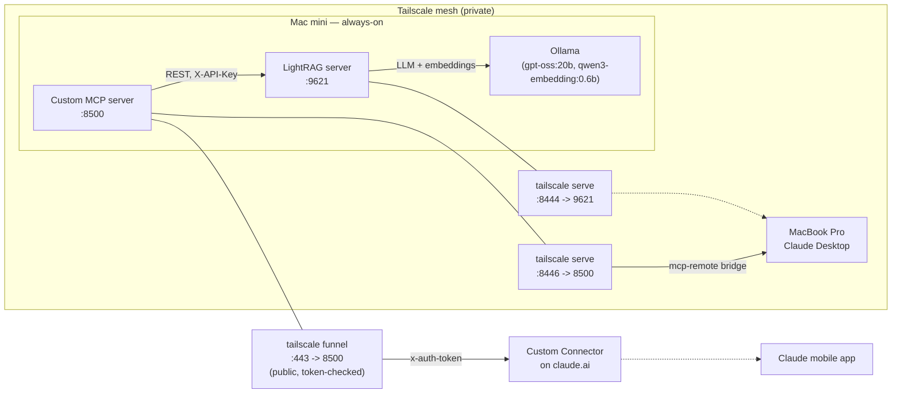

# Part 3: LightRAG + a custom MCP server — long-term memory for the always-on Mac mini

## TL;DR

- [LightRAG](https://github.com/HKUDS/LightRAG) runs as a `launchd` daemon on the Mac mini, using the same Ollama instance from [Part 1](01-ollama-opencode-tailscale.md) for entity/relation extraction and embeddings. It ingests personal documents (PDFs, notes) into a hybrid vector + knowledge-graph store and answers natural-language questions about them, including cross-lingual queries.
- Cognee (originally planned alongside LightRAG) was dropped early: no built-in authentication, and the same DNS-rebinding conflict with `tailscale serve` that shows up elsewhere in this stack (see Part 1.5/1.6).
- Getting a *reasoning* LLM (`gpt-oss:20b`) to extract entities at a usable speed took real tuning — the default configuration was roughly **10x too slow** to be practical. The fix (`OLLAMA_LLM_THINK=low`) is the single most important lesson in this document.
- LightRAG has **no official MCP server**. Every community wrapper we tried (including the most-used one on PyPI) fell behind LightRAG's REST API within months of being published and started failing silently. We ended up writing a ~110-line MCP server ourselves, run as its own `launchd` daemon, exposed over Tailscale exactly like everything else in this stack.
- Two more non-obvious bugs along the way: an SDK version mismatch (`mcp` 1.x vs 2.x, same category of breaking change that also broke the community wrapper) and the MCP SDK's own DNS-rebinding protection rejecting requests proxied through `tailscale serve`.
- The custom server ships in **two versions** ([`mcp-servers/lightrag-mcp/`](mcp-servers/lightrag-mcp) in this repo): [`simple/`](mcp-servers/lightrag-mcp/simple) (`stdio`, no auth, for Claude Desktop on a tailnet-joined machine) and [`remote/`](mcp-servers/lightrag-mcp/remote) (`streamable-http` with a static-token auth check, meant to sit behind Tailscale Funnel and be registered as a Custom Connector on claude.ai — see Part 3.8).

## Architecture



LightRAG and the MCP server are two independent daemons on the Mac mini, each exposed over Tailscale — the same pattern already used for Ollama and OpenCode in Part 1. LightRAG itself stays tailnet-only. The MCP server is additionally exposed **publicly** via `tailscale funnel` (Part 3.8), protected by its own static-token check, so it can be reached by the Claude mobile app and registered as a Custom Connector on claude.ai — the [`simple/`](mcp-servers/lightrag-mcp/simple) version is used instead for tailnet-only Claude Desktop access, with no auth to manage.

## Table of contents

- [Part 3.1 — Why LightRAG, and why not Cognee](#part-31--why-lightrag-and-why-not-cognee)
- [Part 3.2 — Installing LightRAG](#part-32--installing-lightrag)
- [Part 3.3 — Making entity extraction fast enough to be usable](#part-33--making-entity-extraction-fast-enough-to-be-usable)
- [Part 3.4 — `launchd` persistence and Tailscale exposure](#part-34--launchd-persistence-and-tailscale-exposure)
- [Part 3.5 — Ingestion and retrieval](#part-35--ingestion-and-retrieval)
- [Part 3.6 — MCP access: why the community wrapper doesn't work, and the server we wrote instead](#part-36--mcp-access-why-the-community-wrapper-doesnt-work-and-the-server-we-wrote-instead)
- [Part 3.7 — Connecting Claude Desktop over Tailscale](#part-37--connecting-claude-desktop-over-tailscale)
- [Part 3.8 — Going public: auth, Tailscale Funnel, and a Custom Connector on claude.ai](#part-38--going-public-auth-tailscale-funnel-and-a-custom-connector-on-claudeai)
- [Operational notes](#operational-notes)
- [Uninstalling everything](#uninstalling-everything)
- [Sources](#sources)

## Requirements

Same base as Part 1 (Apple Silicon Mac mini, always-on, Ethernet, Tailscale) plus:

- Ollama already running and reachable on the tailnet (Part 1.2/1.5), with at least one general-purpose chat model and one embedding model pulled.
- `uv` for Python environment management (already installed in Part 1.2).
- `~/ai-memory/` as the root for all memory-related data, kept separate from the LightRAG/MCP code itself so re-indexing or swapping engines later doesn't touch source documents (see [Part 3.1](#part-31--why-lightrag-and-why-not-cognee)).

## Part 3.1 — Why LightRAG, and why not Cognee

The plan was originally to pilot both LightRAG and Cognee side by side and pick a winner. Cognee was dropped before a real pilot started, for two structural reasons rather than a feature comparison:

- No built-in authentication on its API — anything reachable on the network could read/write the memory store.
- The same DNS-rebinding-style conflict with `tailscale serve` that this stack already works around for Ollama (Part 1.5) and, as it turns out, for MCP itself (Part 3.6) — except Cognee had no documented workaround.

Given that, LightRAG was validated alone. The folder layout was kept engine-agnostic on purpose:

```
~/ai-memory/
├── raw/          # original source documents — the single source of truth
├── lightrag/     # LightRAG's own storage, inputs, venv, config — fully recomputable
└── lightrag-mcp/ # the custom MCP server (Part 3.6) — a separate access layer
```

`raw/` is never touched by ingestion; `lightrag/storage` can be wiped and rebuilt from `raw/` at any time (and was, several times, during model comparisons in Part 3.3). This three-layer separation — source, index, access — is what let the MCP layer be rewritten from scratch (Part 3.6) without re-ingesting anything.

## Part 3.2 — Installing LightRAG

```bash
mkdir -p ~/ai-memory/raw
mkdir -p ~/ai-memory/lightrag/{storage,inputs}

mkdir -p ~/ai-memory/lightrag/venv
cd ~/ai-memory/lightrag
uv venv venv --python 3.12
source venv/bin/activate
uv pip install "lightrag-hku[api]"
uv pip install ollama   # not pulled in automatically by lightrag-hku[api] — see gotcha below
deactivate
```

> **Gotcha:** `lightrag-hku[api]` does not include the `ollama` Python package, even though the Ollama binding needs it. LightRAG tries to install it on the fly via its internal `pipmaster` on first run, but that self-install fails silently when the process is started by `launchd` (non-interactive environment). Install it explicitly in the venv up front.

Configuration lives in `~/ai-memory/lightrag/.env`:

```bash
HOST=127.0.0.1
PORT=9621
WORKING_DIR=/Users/ai/ai-memory/lightrag/storage
INPUT_DIR=/Users/ai/ai-memory/lightrag/inputs
LIGHTRAG_API_KEY=<generate one, keep it out of version control>

LLM_BINDING=ollama
LLM_MODEL=gpt-oss:20b
LLM_BINDING_HOST=http://<mac-mini-tailscale-ip>:11434
OLLAMA_LLM_NUM_CTX=32768

EMBEDDING_BINDING=ollama
EMBEDDING_BINDING_HOST=http://<mac-mini-tailscale-ip>:11434
EMBEDDING_MODEL=qwen3-embedding:0.6b
EMBEDDING_DIM=1024

# See Part 3.3 for why these three matter
LLM_TIMEOUT=1200
MAX_ASYNC_LLM=1
OLLAMA_LLM_THINK=low
```

`LLM_BINDING_HOST` must be Ollama's **Tailscale IP**, not `127.0.0.1` — even when LightRAG and Ollama run on the same machine, Ollama here is bound to its tailnet interface only (Part 1.5), not to loopback.

## Part 3.3 — Making entity extraction fast enough to be usable

This is the part worth reading even if you skip everything else.

The default configuration processed one chunk of a philosophy PDF in **~12 minutes**. For a 25-chunk document, that's roughly 5 hours — not usable. The instinct was to blame networking or concurrency; neither was the cause.

Ruled out, in order:
1. **Timeout too short** (`LLM_TIMEOUT` default 240s) — raising it just delayed the failure, didn't fix the slowness.
2. **Context window** (`num_ctx=32768`) — a direct test against Ollama with the same context size answered a simple prompt in 22.7s. Not the bottleneck.
3. **Concurrency** (`MAX_ASYNC_LLM` default 4, all queued onto one loaded model) — serializing to `1` is good hygiene on single-GPU hardware, but the first successful chunk still took ~12 minutes with this alone.

The actual cause: **`gpt-oss:20b` is a reasoning model**, and its default reasoning trace was longer than the answer itself even for one-line prompts. On a real 1200-token philosophical chunk, that reasoning overhead dominated the runtime. Ollama exposes a `think` parameter (`low`/`medium`/`high`); LightRAG surfaces it as `OLLAMA_LLM_THINK` (global) or `{ROLE}_OLLAMA_LLM_THINK` per role.

Setting `OLLAMA_LLM_THINK=low` took the same document from **~12 min/chunk to ~1.3–1.5 min/chunk** — roughly an 8–9x improvement, with entity/relation counts in the same order of magnitude as full reasoning.

> **This setting is model-specific, not global.** It broke pure-instruct models outright (`qwen3-coder:30b` returned `does not support thinking (status code: 400)` — Ollama rejects the parameter instead of ignoring it). Track it per model whenever you swap `LLM_MODEL`.

Other models evaluated as alternatives to `gpt-oss:20b`, all under the same 32GB unified-memory constraint:

| Model | Result |
|---|---|
| `gpt-oss:20b` + `think=low` | **Adopted.** ~1.3–1.5 min/chunk, stable, reproducible. |
| `qwen3.6:35b` | Works, but ~4x slower than the baseline — memory-bandwidth bound at 22GB of weights, not a configuration issue. |
| `qwen3-coder:30b` | Reproducible hang on LightRAG's actual extraction prompt, even on a 3-chunk excerpt — the model answers trivial prompts via Ollama directly in under 2 seconds, so this is specific to LightRAG's long structured-output prompt, not general model slowness. Root cause not pinned down further; not worth pursuing given a working baseline. |
| `gemma4:26b` | Same "stuck processing, no progress" symptom observed; not root-caused (see previous row) — a control re-test of the working baseline with the identical switch/reset procedure ruled out an infrastructure problem. |

Two methodology traps worth flagging explicitly, because both produced convincing false readings before being caught:

- **LightRAG's LLM response cache is on by default** (`enable_llm_cache=true`) and persists across restarts. Re-running the "same" test after only changing one setting can silently replay cached responses instead of hitting the LLM again, invalidating any timing comparison. Wipe `storage/kv_store_llm_response_cache.json` — or the whole `storage/` directory — between model comparisons.
- **Log-tail monitoring must be scoped to the current run.** `tail -1` on a `grep` over the full log file can return a line from a previous, unrelated run, producing a false "it's stuck at chunk N" reading. Scope every check to the most recent daemon start:
  ```bash
  LASTSTART=$(grep -n "Role LLM Configuration (initialized)" ~/ai-memory/lightrag/lightrag.log | tail -1 | cut -d: -f1)
  tail -n +$LASTSTART ~/ai-memory/lightrag/lightrag.log | grep -oE "Chunk [0-9]+ of [0-9]+" | tail -5
  ```
  For timing specifically, anchor on the `"Chunking F:"` log line (printed once, at the real start of processing) — not `"workers initialized"`, which reprints on every single LLM call and will make a run look instantaneous.

## Part 3.4 — `launchd` persistence and Tailscale exposure

Same pattern as Ollama/OpenCode in Part 1.4–1.5: a `launchd` daemon, log files pre-created before `bootstrap` (the usual silent `exit code 78` otherwise), one Tailscale HTTPS mapping per service.

```bash
sudo tee /Library/LaunchDaemons/ai.lightrag.server.plist > /dev/null << 'EOF'
<?xml version="1.0" encoding="UTF-8"?>
<!DOCTYPE plist PUBLIC "-//Apple//DTD PLIST 1.0//EN" "http://www.apple.com/DTDs/PropertyList-1.0.dtd">
<plist version="1.0">
<dict>
    <key>Label</key><string>ai.lightrag.server</string>
    <key>ProgramArguments</key>
    <array><string>/Users/ai/ai-memory/lightrag/venv/bin/lightrag-server</string></array>
    <key>UserName</key><string>ai</string>
    <key>WorkingDirectory</key><string>/Users/ai/ai-memory/lightrag</string>
    <key>RunAtLoad</key><true/>
    <key>KeepAlive</key><true/>
    <key>StandardOutPath</key><string>/var/log/lightrag-server.log</string>
    <key>StandardErrorPath</key><string>/var/log/lightrag-server-error.log</string>
    <key>EnvironmentVariables</key>
    <dict>
        <key>PATH</key><string>/opt/homebrew/bin:/usr/local/bin:/usr/bin:/bin</string>
        <key>HOME</key><string>/Users/ai</string>
    </dict>
</dict>
</plist>
EOF

sudo touch /var/log/lightrag-server.log /var/log/lightrag-server-error.log
sudo chown ai:staff /var/log/lightrag-server.log /var/log/lightrag-server-error.log
sudo chmod 644 /var/log/lightrag-server.log /var/log/lightrag-server-error.log
sudo launchctl bootstrap system /Library/LaunchDaemons/ai.lightrag.server.plist

tailscale serve --bg --https=8444 9621
```

> **Gotcha, recurring across this whole stack:** `bootout` immediately followed by `bootstrap` in the same command frequently fails with `Bootstrap failed: 5: Input/output error` — launchd hasn't finished tearing down the previous job yet. Run them as two separate commands and expect to retry the `bootstrap` once; it has worked on the first retry every time this came up.

> **Never run the server by hand from a terminal to try a new model.** A manually-started process dies the moment the SSH session or terminal closes, which looks exactly like a crash/hang from the outside. Always change `.env`, then `bootout` + `bootstrap` the daemon — this was the actual root cause of an "it keeps freezing" incident that turned out to be nothing more than a `launchd` job that had never been re-created after a manual test session.

## Part 3.5 — Ingestion and retrieval

Documents go into `~/ai-memory/raw/` (source of truth) and are copied or uploaded into LightRAG's `inputs/` for processing — via the WebUI, `scp`, or the MCP `upload_document`/`insert_note` tools from Part 3.6.

Monitoring commands (all scoped to the current daemon run, per the methodology in Part 3.3):

```bash
# Pipeline status
LRKEY=$(grep LIGHTRAG_API_KEY ~/ai-memory/lightrag/.env | cut -d= -f2)
curl -s -H "X-API-Key: $LRKEY" http://127.0.0.1:9621/documents/status_counts | python3 -m json.tool

# Chunk-by-chunk progress, current run only
LASTSTART=$(grep -n "Role LLM Configuration (initialized)" ~/ai-memory/lightrag/lightrag.log | tail -1 | cut -d: -f1)
tail -n +$LASTSTART ~/ai-memory/lightrag/lightrag.log | grep -oE "Chunk [0-9]+ of [0-9]+" | tail -5
```

Retrieval modes matter more than they might look:

- **`naive`** (pure vector similarity) fails for cross-lingual queries — asking a question in Italian about English-language source text returns no context at all, because the query embedding doesn't clear the similarity threshold against embeddings in a different language.
- **`hybrid`** / **`mix`** work correctly cross-lingually — an extra keyword-extraction LLM call ahead of graph retrieval bridges the language gap. Expect roughly 100–120s per query (two sequential `think=low` LLM calls), which is the fixed cost, not an anomaly.

**Always use `hybrid` or `mix` unless every document and every query are guaranteed to be in the same language.**

## Part 3.6 — MCP access: why the community wrapper doesn't work, and the server we wrote instead

LightRAG has **no official MCP server** — the upstream project exposes only a REST API, a WebUI, and a Python SDK. Every MCP integration for it is a third-party wrapper, maintained independently of LightRAG's own (fast) release cadence.

The most commonly referenced one on PyPI turned out to be stuck at version `0.1.1` (its only real release, from several months prior) while LightRAG itself had since removed/renamed the exact endpoint that wrapper depended on for listing documents (`GET /documents` → `POST /documents/paginated`). Because the wrapper's HTTP client is auto-generated from an OpenAPI schema captured at build time, an endpoint or response shape it doesn't recognize doesn't raise an error — it returns `None` silently. Result: a health-check tool that appeared to work, while every other tool (list documents, query, pipeline status) quietly returned nothing, with the underlying server working perfectly the whole time (confirmed by calling the same REST endpoints directly with `curl`).

A few similar wrappers exist (varying tool counts, Python or Node-based, adoption ranging from a handful of stars to a few dozen) — all carry the same structural risk: a community project chasing a REST API that changes faster than anyone has an incentive to track for free.

Given the actual REST surface needed was small and already verified working, we wrote a **~110-line MCP server** instead, using the official Python `mcp` SDK, running as its own process on the Mac mini and exposing only the tools this project actually needs — deliberately excluding graph-editing operations (`insert_entity`, `delete_relation`, etc.) that a personal knowledge base has no real use for and that would be pure attack surface if this server is ever exposed more broadly.

```python
from mcp.server.fastmcp import FastMCP
from mcp.server.transport_security import TransportSecuritySettings
import httpx, os

mcp = FastMCP(
    "lightrag-knowledge-base",
    host="127.0.0.1",
    port=int(os.environ["MCP_HTTP_PORT"]),
    transport_security=TransportSecuritySettings(
        enable_dns_rebinding_protection=True,
        allowed_hosts=["127.0.0.1:*", "localhost:*", "<mac-mini>.<tailnet>.ts.net:*"],
        allowed_origins=["http://127.0.0.1:*", "https://<mac-mini>.<tailnet>.ts.net:*"],
    ),
)

@mcp.tool()
def query_knowledge_base(query: str, mode: str = "hybrid", top_k: int = 40) -> dict:
    with httpx.Client(base_url=os.environ["LIGHTRAG_BASE_URL"],
                       headers={"X-API-Key": os.environ["LIGHTRAG_API_KEY"]}) as c:
        r = c.post("/query", json={"query": query, "mode": mode, "top_k": top_k})
        r.raise_for_status()
        return r.json()

# ...plus list_documents, get_status, upload_document, insert_note, check_health,
# scan_for_new_documents — each a thin pass-through to a verified REST endpoint.
```

(Full source lives in [`mcp-servers/lightrag-mcp/server.py`](#) in this repo — or its own repo, see the note at the end of this document.)

Two SDK-level issues surfaced while building this, both worth documenting because they're easy to mistake for application bugs:

**1. `mcp` 1.x → 2.x breaking change.** Installing `mcp` without a version pin resolves the latest 2.x release, where `FastMCP` was renamed to `MCPServer` with a different API — `from mcp.server.fastmcp import FastMCP` fails with a `ModuleNotFoundError` that (helpfully) names the migration path. Same category of breakage that hit the third-party wrapper above. Fix: pin `mcp<2` explicitly.

```bash
uv pip install "mcp<2" httpx
```

**2. DNS-rebinding protection rejecting Tailscale-proxied requests.** The MCP Python SDK's streamable-HTTP transport validates the `Host` header by default and rejects anything other than `localhost`/`127.0.0.1` — a legitimate security feature against DNS-rebinding attacks, but it also rejects requests forwarded by `tailscale serve`, which passes through the real hostname (`<mac-mini>.<tailnet>.ts.net:<port>`). Symptom: `HTTP 421 Misdirected Request`, `"Invalid Host header"`, only when accessed via the Tailscale URL — a plain `curl` to `127.0.0.1` works fine, which is what makes this confusing to diagnose. Fix: explicitly allow the Tailscale hostname (see `TransportSecuritySettings` above).

`launchd` setup mirrors LightRAG's own (Part 3.4) — separate plist (`ai.lightrag.mcp`), its own venv, its own Tailscale HTTPS mapping:

```bash
tailscale serve --bg --https=8446 8500
```

## Part 3.7 — Connecting Claude Desktop over Tailscale

As of writing, `claude_desktop_config.json` no longer accepts a bare remote `url` entry under `mcpServers` — it validates against a stdio-only schema and silently drops anything else. Claude's UI-based "Custom Connector" flow does support remote URLs, but requires the endpoint to be **publicly reachable**, since that traffic is proxied through Anthropic's own infrastructure rather than originating from the local device — incompatible with a tailnet-only design.

The workaround is the [`mcp-remote`](https://www.npmjs.com/package/mcp-remote) bridge: Claude Desktop launches it as an ordinary local `stdio` subprocess (satisfying the config schema), and it internally speaks Streamable HTTP to the real, Tailscale-only URL.

```json
{
  "mcpServers": {
    "lightrag-knowledge-base": {
      "command": "npx",
      "args": ["-y", "mcp-remote", "https://<mac-mini>.<tailnet>.ts.net:8446/mcp", "--transport", "http-only"]
    }
  }
}
```

This keeps the whole system tailnet-private end to end — no public exposure, no OAuth, authentication is Tailscale's device identity plus LightRAG's own API key (forwarded internally by the MCP server, not by the client). The trade-off: it only works from devices already on the tailnet, and every client machine needs Node/`npx` available. This is the [`simple/`](mcp-servers/lightrag-mcp/simple) server — use it if tailnet-only access is enough for you.

## Part 3.8 — Going public: auth, Tailscale Funnel, and a Custom Connector on claude.ai

The Claude mobile app, and a Custom Connector registered on claude.ai generally, don't reach a tailnet-private endpoint at all — they fetch through Anthropic's own infrastructure, which has no route into your tailnet. Reaching them means exposing the MCP server on the public internet, which in turn means it needs its own authentication — the Tailscale network boundary that was the only gate so far disappears once the endpoint is public. This is what the [`remote/`](mcp-servers/lightrag-mcp/remote) server adds on top of everything in Part 3.6.

**Authentication.** The MCP Python SDK does have a built-in auth mechanism (`token_verifier`/`AuthSettings` on `FastMCP`), but it's built for a real OAuth authorization server — it requires an `issuer_url` and expects a full OAuth flow, which is a lot of machinery for a single-user server with one static secret. Instead, `remote/server.py` gets the raw ASGI app via `mcp.streamable_http_app()` (skipping `mcp.run()` entirely) and wraps it in a small Starlette middleware that checks a static token:

```python
class TokenAuthMiddleware(BaseHTTPMiddleware):
    async def dispatch(self, request, call_next):
        provided = request.headers.get("x-auth-token", "").strip()
        if not provided:
            auth_header = request.headers.get("authorization", "")
            if auth_header.lower().startswith("bearer "):
                provided = auth_header[7:].strip()
        if not provided or not secrets.compare_digest(provided, MCP_AUTH_TOKEN):
            return JSONResponse({"error": "unauthorized"}, status_code=401)
        return await call_next(request)

app = mcp.streamable_http_app()
app.add_middleware(TokenAuthMiddleware)
uvicorn.run(app, host="127.0.0.1", port=MCP_HTTP_PORT)
```

Two headers are accepted on purpose. `Authorization` is what a generic MCP client (`mcp-remote`, `curl`) would naturally use — but claude.ai's own Custom Connector setup UI reserves that header for its own OAuth bearer token and doesn't let you set it manually, offering a small set of custom header names instead. `x-auth-token` is one of those, so the server checks it first and falls back to `Authorization: Bearer` for everything else.

**Tailscale Funnel, and a port gotcha.** `tailscale serve` (Part 3.4/3.6) is tailnet-only by design; `tailscale funnel` is the equivalent for public exposure:

```bash
sudo tailscale funnel --bg --https=443 8500
```

> **Gotcha:** Tailscale Funnel only routes **ports 443, 8443, and 10000** to the public internet. The CLI happily accepts `--https=8446` (the port already used for `tailscale serve` in Part 3.6) and reports it as "Available on the internet" — but it simply isn't reachable from outside the tailnet on that port. Worse, even switching to 10000 (a Funnel-supported port) still failed specifically in claude.ai's Custom Connector reachability check ("Couldn't reach this address"), while working fine for direct `curl` — suggesting that infrastructure only egresses to port 443. **443 is the port that actually worked end to end.**

**A second DNS-rebinding-protection wrinkle.** With `MCP_ALLOWED_HOSTS` set to a bare hostname (no port) and the server on port 443, the naive way to build the SDK's `allowed_hosts` list (turning a bare host into a `host:*` wildcard pattern) doesn't match — the SDK's own matcher requires a literal `:` for the wildcard form, but a `Host` header omits the port entirely when it's the scheme's default (443 for HTTPS). The result was the same `421 Invalid Host header` from Part 3.6, but on the *correct* hostname this time. Fix: add both the bare hostname and the `:*` wildcard form to `allowed_hosts` (see `remote/server.py` — this is why it treats a portless `MCP_ALLOWED_HOSTS` entry specially rather than just appending `:*`).

**Registering the Custom Connector**, once the server answers `401`/`200` correctly over the public URL:

1. claude.ai → Settings → Connectors → Add custom connector.
2. URL: `https://<mac-mini>.<tailnet>.ts.net/mcp` (port 443, so it's omitted from the URL).
3. Request headers → add `x-auth-token` with the server's `MCP_AUTH_TOKEN` as the value.

No OAuth client setup is needed on the connector side despite the UI presenting OAuth-client options — the server doesn't implement OAuth at all, and the header-based token is what actually authenticates the connection.

> **Security notes, both accepted trade-offs rather than bugs, worth knowing before relying on this:**
> - **One token, both read and write.** `insert_note` and `upload_document` are gated by the exact same token as the read-only tools. If `MCP_AUTH_TOKEN` ever leaks, the blast radius isn't "someone can read my notes" — it's "someone can inject arbitrary text into the knowledge base", which later comes back to you as the result of a query. That's a self-inflicted prompt-injection vector, not just a privacy leak. A single 256-bit token generated with `secrets.token_urlsafe(32)` is not practically guessable, so the realistic risk is the token being pasted somewhere public (a shared terminal recording, a chat log, a public gist) — treat it with the same care as a password, and regenerate it (new `MCP_AUTH_TOKEN`, restart the daemon, update the Custom Connector) if you ever suspect it has.
> - **The token lives in plaintext in `/Library/LaunchDaemons/ai.lightrag.mcp.plist`**, same as `LIGHTRAG_API_KEY` — see the plist-permissions note in [Part 1.6](01-ollama-opencode-tailscale.md#part-16--network-security-checklist). Worth a `chmod 600` on that specific plist given it's now reachable from the public internet, not just the tailnet.

## Operational notes

- LightRAG's LLM response cache (Part 3.3) survives restarts; wipe it (`storage/kv_store_llm_response_cache.json`, or the whole `storage/` directory) before any timing comparison, not just a content comparison.
- `~/ai-memory/raw/` is the only thing that isn't recomputable — back it up like any other personal data; `lightrag/storage` and the MCP server's own state are both safe to delete and rebuild.
- The [`simple/`](mcp-servers/lightrag-mcp/simple) server has no authentication of its own beyond the Tailscale network boundary — fine for tailnet-private `stdio` use, never expose it publicly as-is. The [`remote/`](mcp-servers/lightrag-mcp/remote) server (Part 3.8) adds a static-token check specifically so it's safe behind a public Funnel.

## Uninstalling everything

In reverse dependency order:

```bash
# MCP server
sudo tailscale funnel --https=443 off   # if using remote/ + Funnel (Part 3.8)
tailscale serve --https=8446 off        # if using simple/ + tailscale serve (Part 3.6)
sudo launchctl bootout system/ai.lightrag.mcp
sudo rm /Library/LaunchDaemons/ai.lightrag.mcp.plist
sudo rm /var/log/lightrag-mcp*.log
rm -rf ~/ai-memory/lightrag-mcp

# LightRAG
tailscale serve --https=8444 off
sudo launchctl bootout system/ai.lightrag.server
sudo rm /Library/LaunchDaemons/ai.lightrag.server.plist
sudo rm /var/log/lightrag-server*.log
rm ~/ai-memory/lightrag/.env
rm -rf ~/ai-memory/lightrag/venv

# Embedding model (only if not used elsewhere)
ollama rm qwen3-embedding:0.6b

# Source documents — keep unless you're sure you don't need them
# rm -rf ~/ai-memory/raw
```

On the client side, remove the `lightrag-knowledge-base` entry from `claude_desktop_config.json`.

## Sources

- [HKUDS/LightRAG](https://github.com/HKUDS/LightRAG) — no official MCP server; REST API + WebUI + Python SDK only
- [Ollama — Thinking capability docs](https://docs.ollama.com/capabilities/thinking) — `think` parameter syntax
- [HuggingFace openai/gpt-oss-20b discussion — disabling thinking mode](https://huggingface.co/openai/gpt-oss-20b/discussions/86) — confirms no full disable for this model family, only low/medium/high
- [PyPI — lightrag-mcp](https://pypi.org/project/lightrag-mcp/) — the community wrapper found stuck at v0.1.1, no HTTPS/TLS support
- [Tailscale blog — Making an MCP server more robust, and much more private](https://tailscale.com/blog/model-for-mcp-connectivity-lee-briggs) — confirms tailnet-private endpoints aren't reachable by claude.ai's own remote-MCP infrastructure
- [modelcontextprotocol/python-sdk issue #1798 — resolving 421 Invalid Host Header](https://github.com/modelcontextprotocol/python-sdk/issues/1798) — the DNS-rebinding-protection fix used in Part 3.6
- [mcp-remote on npm](https://www.npmjs.com/package/mcp-remote) — stdio-to-HTTP bridge used in Part 3.7
- [Tailscale — `tailscale funnel` reference](https://tailscale.com/kb/1311/tailscale-funnel) — confirms Funnel only routes ports 443, 8443, and 10000 publicly (Part 3.8)
- [tailscale/tailscale issue #14625 — Funnel TCP behavior differs between 443/8443/10000 and other ports](https://github.com/tailscale/tailscale/issues/14625) — corroborates the port restriction found empirically in Part 3.8
